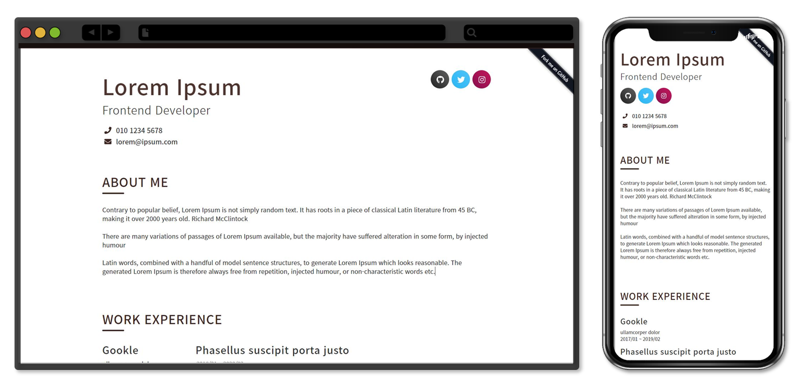

# Resume Kit

*`next.js` 의 [Static HTML Export](https://nextjs.org/docs/advanced-features/static-html-export) 를 활용해 이력서를 관리할 수 있는 템플릿입니다. 공짜로 Github 에 이력서를 관리하세요.*



[샘플 확인하기](https://parkoon.github.io/resume-kit)

## 기능 리스트

---

- 프로필, 기술, 회사, 교육, 포스팅, 기타와 같은 이력서에 필요한 데이터 작성
- SEO를 기반한 메타데이터 작성
- 오픈 그래프 이미지 생성
- 이력서 메인 색상 변경
- 깃허브 페이지로 배포하기
- 이력서 섹션 활성화 / 비활성화
- 이력서 섹션 순서 변경
- 이력서 미리보기

## 설치 및 실행 가이드

---

### Step 1 - Git Clone

`https://github.com/parkoon/resume-kit.git` 를 클론 받습니다.

```
$ git clone https://github.com/parkoon/resume-kit.git

```

## Step 2 - Reset Git

클론을 받은 이후에 git history 를 모두 지우고 본인의 깃을 등록해줘야 합니다.

```
$ rm -rf .git
$ git remote add origin https://github.com/{{your-github-repository}}
$ git commit -am 'Init resume project'
$ git push
```

### Step 3. Install

`clone` 받은 폴더로 가서 아래 명령어를 실행합니다. ([노드](https://nodejs.org/ko/)가 설치되어 있어야 합니다)

```
$ npm install
$ npm start
```

### Step 4. Start

설치가 완료됐다면, [관리 페이지](http://localhost:3000/admin/profile)에 접속합니다.

## 관리 페이지

---

**설치 및 실행 가이드**를 완료되었다면 아래와 같은 화면을 볼 수 있습니다.

이력서 페이지 및 배포 설정이 되어 있지 않아 발생한 오류로, **[입력하기]** 버튼을 클릭하여 설정페이지로 이동합니다.

설정 페이지로 이동 후 메타 데이터 관리의 필드를 모두 채워주시면 됩니다.

> 홈페이지 필드는 본인의 이력서가 배포될 주소가 됩니다. https://your-github-name.github.io/your-github-resume-repository 형식으로 작성합니다.

설정 페이지의 우측 상단에 있는 **[설정 가이드 보기]** 를 클릭하여 자세한 내용을 확인 할 수 있습니다.

## 배포하기

---

데이터를 모두 입력했다면 `http://localhost:1207/admin/setting` 로 이동하여 **[배포하기]** 를 클릭합니다.

## 추 후 개선될 사항들

- [ ] 사진 업로드 및 사이즈 조정
- [ ] 페이지 잠금
- [ ] 파일 히스토리
- [ ] PDF 로 변환하기
- [ ] ...

## 기타

프로젝트 성장을 위한 피드백은 언제든 환영입니다.
