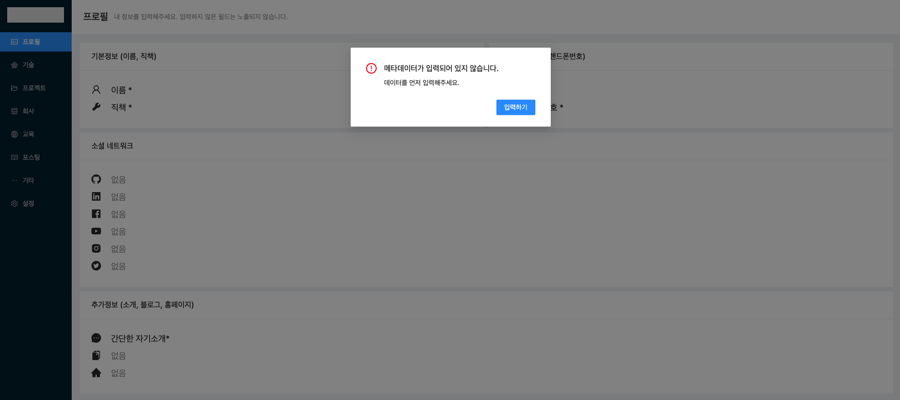

# Resume Kit

> 이력 관리 및 공유를 쉽게 하고자 시작한 프로젝트

[데모 보기](https://parkoon.github.io/resume-kit)

## 리뉴얼 및 버그 수정 🐜

- [x] this is subtitle 제거
- [x] 변경 알림
- [x] 스킬 레벨 설정
- [x] 섹션 활성화 부분에 article 누락
- [x] 빌드안하고 제공하니 느림
- [x] 네비게이션 순서
- [x] 스킬 추가 등록 - svn, webOS
- [x] 프로젝트 등록할 때 기술 부분에 등록된 기술 전부 노출 안됨
- [x] Add field 명칭 변경
- [x] 자격증과 같이 기간이 아닌 날이 고정 된 경우도 있음
- [x] 중복클릭 방지 (만들기)
- [x] 프로젝트 생성시 업무가 추가 안됨
- [x] 이력서 미리보기 페이지 만들기 (Iframe 지우기)
- [x] 업무 반영이 안됨
- [x] ~~Next SEO~~
- [x] 리드미 업데이트
- [x] 프로젝트에서 회사에 있는 프로젝트는 정렬되는데, 회사는 정렬이 안됨 (회사는 제일 최근부터...)
- [x] 회사를 만든 상태에서, 프로젝트를 생성하고, 회사를 지웠을 때 프로젝트 페이지에서 에러 발생
- [x] 프로젝트 페이지에서, 회사 선택하는 필드 포커스가 빠졌음에도 원상태로 돌아오지 않음
- [ ] 프로젝트 정렬 (Feat, 회사, 등록일, 초기화)
- [ ] 스킬 페이지 내 순서 변경
- [ ] 스킬 페이지 내 타이틀 순서 변경
- [ ] 이력서 스킬 섹션에 레벨 추가
- [ ] 이력서 섹션 간 Divider 추가

## 기능 리스트

---

- 프로필, 기술, 회사, 교육, 포스팅, 기타와 같은 이력서에 필요한 데이터 작성
- SEO를 기반한 메타데이터 작성
- 오픈 그래프 이미지 생성
- 이력서 메인 색상 변경
- 깃허브 페이지로 배포하기
- 이력서 섹션 활성화 / 비활성화
- 이력서 섹션 순서 변경
- 이력서 미리보기

## 설치 및 실행 가이드

---

### Step 1 - Github Account

[깃허브](https://github.com) 계정을 로그인 합니다.

### Step 2 - Git Clone

`https://github.com/parkoon/resume-kit.git` 를 클론 받습니다.

클론을 받은 이후에 git history 를 모두 지우고 본인의 깃을 등록해줘야 합니다.

이 후에 최초 커밋 및 푸시를 해줍니다.

```
$ git clone https://github.com/parkoon/resume-kit.git
$ rm -rf .git
$ git remote -v // 모두 삭제되어
$ git remote add origin https://github.com/{{your-github-repository}}
$ git commit -am 'Init resume project'
$ git push
```

### Step 3. Start

클론을 받은 폴더로 가서 아래 명령어를 실행합니다. ([노드](https://nodejs.org/ko/)가 설치되어 있어야 합니다)

```
$ npm install
$ npm start
```

위 스크립트 실행이 완료되면, [관리 페이지](http://localhost:3000/admin/profile)에 접속합니다.

## 관리 페이지

---

**설치 및 실행 가이드**를 완료되었다면 아래와 같은 화면을 볼 수 있습니다.

이력서 페이지 및 배포 설정이 되어 있지 않아 발생한 오류로, **[입력하기]** 버튼을 클릭하여 설정페이지로 이동합니다.

설정 페이지로 이동 후 메타 데이터 관리의 필드를 모두 채워주시면 됩니다.

> 홈페이지 필드는 본인의 이력서가 배포될 주소가 됩니다. https://your-github-name.github.io/your-github-resume-repository 형식으로 작성합니다.

설정 페이지의 우측 상단에 있는 **[설정 가이드 보기]** 를 클릭하여 자세한 내용을 확인 할 수 있습니다.

## 배포하기

---

데이터를 모두 입력했다면 `http://localhost:1207/admin/setting` 로 이동하여 **[배포하기]** 를 클릭합니다.

## 추 후 개선될 사항들

- [ ] 사진 업로드 및 사이즈 조정
- [ ] 페이지 잠금
- [ ] 파일 히스토리
- [ ] PDF 로 변환하기
- [ ] ...

## 기타

프로젝트 성장을 위한 피드백은 언제든 환영입니다.
